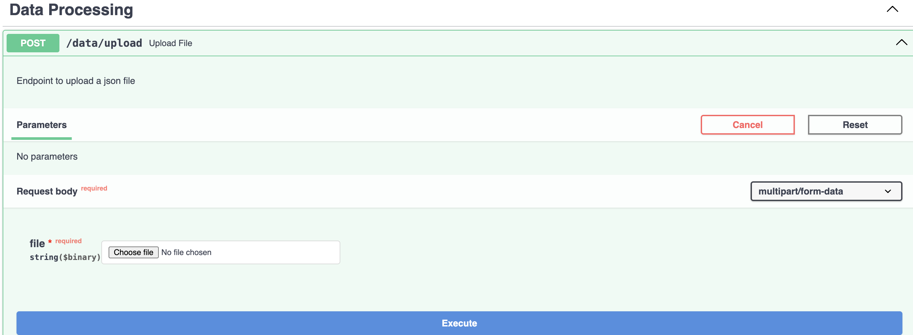

# 💼 Intelligent Financial Question Answering with LLMs + RAG

This repository presents a Retrieval-Augmented Generation (RAG) framework powered by Large Language Models (LLMs) to accurately respond to financial queries from structured documents. Designed for the **Tomoro.ai Technical Challenge**, it leverages the ConvFinQA dataset and integrates scalable components for document ingestion, vector-based retrieval, and dynamic model configuration.

---


## 🎯 What This Project Delivers

The goal is to simulate how AI can enable smart financial analysis by:
- Accepting structured financial data (e.g., tables)
- Retrieving the most relevant data segments using vector search
- Generating concise, accurate answers via LLMs
- Optionally evaluating the performance of each response

---

## 🧠 Tech Stack & Tools

| Purpose               | Tool / Framework         |
|-----------------------|--------------------------|
| API Framework         | FastAPI                  |
| Semantic Search       | Azure AI Vector Database |
| LLMs                  | OpenAI / Claude          |
| Embeddings            | OpenAI / HuggingFace     |
| Evaluation Metrics    | RAGAS                    |
| API Testing Interface | Swagger UI               |

---

## 📄 Documentation & User Guide

1. **API Documentation**: 
   The Swagger UI provides interactive documentation of all available endpoints for easy testing and exploration.
   
2. **End-User Guide**:
   - **Uploading Data**: Users can upload their financial data (JSON format) through the API.
   - **Querying Data**: You can submit natural language questions about the financial data, and the system will retrieve and generate answers based on the context.

## ⚙️ How to Set It Up

### 1. Clone This Repository

```bash
git clone https://github.com/arfaaowte/rag_llm_project.git
cd rag_llm_project
```

### 2. Create a Virtual Environment

```bash
python3 -m venv venv
source venv/bin/activate  # On Windows: venv\Scripts\activate
```
### 3. Install Dependencies

```bash
pip install -r requirements.txt
```

### 4. Set Up Variables in config.ini

Create a `config.ini` file in the root directory with the following structure:

```ini
[APP_PROPERTIES]
openai_api_key=your_openai_api_key
openai_model=your_openai_model
anthropic_api_key=your_anthropic_api_key
anthropic_model=your_anthropic_model
embedding_model=your_embedding_model
azure_search_endpoint=your_azure_search_endpoint
azure_search_key=your_azure_search_key
evaluation_model=your_evaluation_model
```

### 5. Run the Application

```bash
uvicorn main:app --reload --loop asyncio
```

### 6. Interactive API Access
Once running, access the API via:

```bash
http://localhost:8000/docs
```

---

###Features available in the Swagger UI:
- Upload custom data files
- Specify index and file scope
- Configure model behavior
- Enable real-time evaluation
---

## 🏗️ System Architecture


## 🌐 System Flow Diagram

The architecture involves:
- Document ingestion and embedding

- Storage and indexing in Qdrant

- Query handling and semantic retrieval

- Answer generation with LLM

- Optional RAGAS-based scoring

---

## 🛠️ Key Capabilities
Upload ConvFinQA or any custom JSON input

Use filename and index_name to filter response scope

Customize LLM parameters (temperature, max_tokens, etc.)

Optional accuracy evaluation toggle via enable_evaluation

---
## 💡 Design Rationale
Why Azure AI Search?

Azure AI Search was chosen for its robust vector database capabilities, allowing efficient storage and retrieval of embeddings. It also integrates seamlessly with FastAPI, enhancing the overall architecture.

Why RAG Instead of Fine-Tuning?

Fine-tuning would be cost- and resource-intensive, especially given the structure of ConvFinQA. RAG offers a far more scalable and interpretable method.

Why Swagger?

Swagger provides an intuitive, zero-code way to interact with the backend — making it easy for technical and non-technical reviewers to test endpoints.

---

## 🔎 Strategic Tradeoff
I initially explored restructuring tabular JSON data into descriptive paragraphs using LLMs — an approach ideal for retrieval.                             

However:
The token usage quickly exceeded resource limits

It became impractical for scaling with limited credits

Hence, I shifted to directly uploading the structured data with clear instructions for filename-level filtering. 

This compromise keeps the pipeline simple and functional, while leaving room for future enhancement with better formatting.

---

## 📊 Evaluation with RAGAS
To measure how effective each answer is, the system optionally uses RAGAS — an open-source evaluation toolkit tailored for RAG pipelines. Metrics include:

- Faithfulness: Is the answer grounded in the retrieved context?

- Context Precision: Were relevant chunks retrieved?

- Relevance: Does the answer address the question?

Toggle evaluation using:
```python
enable_evaluation=True
```
in the API call.

---

## 📈 Dataset
Used train.json from the ConvFinQA dataset, which includes QA pairs based on complex financial reports and tables.

---
## 🌱 Future Plans

Reintroduce unstructured transformation of financial tables

Add frontend interface via Streamlit or Next.js

Support multi-hop queries

Integrate PDF/Excel ingestion using Azure Document Intelligence

## Snippets from swagger UI





---

## 👤 Maintainer
Arfa Patekari

📧 aowtearfa@gmail.com

🔗 [LinkedIn](https://www.linkedin.com/in/arfaaowte/)